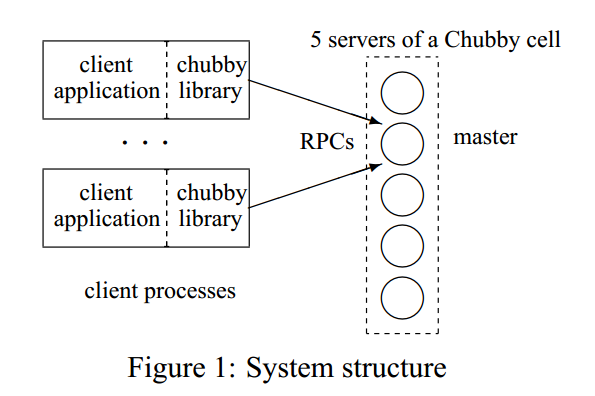
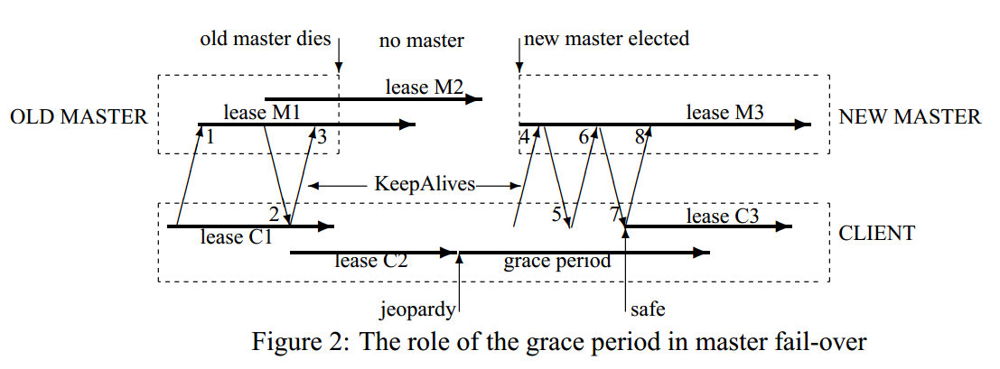

# 1. Introduction

本文是读google chubby的论文总结。

chubby是一个分布式的锁服务，其设计目标包括两点：

- 使用清晰易懂的语义，为大规模数量的客户端提供服务，并且保证可靠性和可用性
- 吞吐量和存储能力的优先级放在第二位

chubby的使用场景有很多，例如

- GFS用chubby来选举master
- Bigtable用chubby来选举master，发现tablet server等等

对于选择问题，是经典的分布式一致性问题，chubby采用Paxos算法来保证一致性。

# 2. Design

## 2.1 Rationale

本节讨论了google为什么以服务的方式来实现chubby，而不是采用Client Paxos Library方式来实现chubby的原因，包括

- 一个应用刚起步的时候负载往往比较小，所以对于可用性的需求比较少，当应用发展到一定规模时，就会在可用性上花费功夫，如果采用Client Paxos Library的方式，对于应用的改动量比较大；而如果采用服务的方式，则需要简单的几条语句就能实现。因此，采用服务方式，是符合应用增长的趋势的需求的。
- 许多客户端使用chubby来进行选主，因此，需要机制来广播结果。chubby通过小文件的读写很方便的实现了这个功能。这个功能也可以用命名服务来实现，但集成到chubby中可以减少客户端依赖的server数量，并且命名服务和锁服务用到的分布式一致性的协议是一样的，所以，没有必要重复造轮子。
- 开发者对于基于锁的接口更熟悉，更容易上手。
- 分布式一致性算法为了保证可用性，需要多副本才能保证高可用性，采用服务的方式，单个客户端也能保证锁服务的可用性。

基于上述的比较，chubby的两个关键设计目标为

- 提供锁服务，而不是client library
- 采用小文件来广播选主的结果，而不是维护另一个服务

基于使用环境的反馈，chubby还有如下设计目标

- 通过chubby文件广播选主结果的服务可能有成千上万个客户端，因此，需要允许这些客户端来监听此文件的变化，最好不需要投入太多的服务器来支撑。
- 在主发生变化的时候，客户端需要及时知道，因此，提供事件通知机制比客户端轮询要更有效。
- 有不少客户端有轮询文件的需求，因此，实现文件缓存是非常有必要的。
- 实现一致性缓存，方便开发者使用。
- 为了安全性，提供访问控制功能。

最重要的一点是，chubby期望开发者使用的是粗粒度的锁服务。

粗粒度的锁服务和细粒度的锁服务的区别如下

- 粗粒度锁一般是很少被获取，一旦有客户端获取锁，占用的时间会比较长，经常以小时或者天为单位；细粒度锁被占用的时间比较短，但是，会被客户端频繁获取。
- 粗粒度锁服务的获取频率和业务的执行频率无关；客户端对粗粒度锁服务的恢复开销比较大，因此，需要在服务端支持高可用性，即锁所在服务器挂掉不会造成客户端失去锁的控制权；临时的锁服务不可用不会造成太多客户端的故障。
- 细粒度锁服务的获取频率和业务的执行频率相关，客户端对细粒度锁服务的恢复开销不大，因此，锁在的服务器挂掉后，一般不恢复客户端获取的锁；临时的锁服务不可用会造成很多客户端故障。

## 2.2 System structure

chubby的两个关键组件是chubby library和chubby servers(chubby cell)，另一个可选的组件是proxy server，将在3.1节讨论。

chubby cell由多台chubby server组成，也称作副本，采用分布式一致性协议选主。副本都会维护数据库的拷贝，但只有主提供读和写服务，其他副本只从主拉取最新的数据。

**客户端发现主的流程**

所有副本的IP信息放在DNS中，客户端通过和DNS列出的服务器通信来获取master地址。如果客户端请求的是一台非master服务器，它会返回master的地址；如果请求的master，则会告知客户端。客户端定位master后，会把所有请求都提交给master，直到它停止响应或者不再是主了。

**读写请求**

写请求通过一致性协议，需要写入多数派的副本才算写成功。

读请求只能通过master来响应，如果master挂掉，会在秒级别选出新主提供服务。

**副本故障**

如果某个副本挂掉，并且小时级别内没有恢复，那么采用以下故障恢复流程

- 从资源池中选择一台新机器，在上面安装chubby server，并启动服务。
- 更新DNS表，用新机器的IP地址替换老的。
- 当前的master会定期询问DNS，然后发现新替换的server，然后把新成员更新到数据库里面，这个更新会通过一致性协议同步到其他的副本上。
- 新替换的chubby server也会从master拉取最新的数据库拷贝，可能会基于最新的备份，然后恢复其之后的修改。 

## 2.3 Files, directories, and handles

chubby提供一个类似于UNIX的文件系统接口，一个典型的名称为

`ls/foo/wombat/pouch`

- `ls`前缀对于所有chubby名称都一样，代表`lock service`的意思
- `foo`是一个chubby cell的名称，DNS中会根据这个名称查找到一台或多台chubby server
- `/wombat/pouch`是在chubby cell里面的路径名

chubby的文件系统接口和UNIX不同的地方有

- 为了让不同目录的文件可以由不同的chubby master来提供服务，chubby不允许文件从一个目录移动到另一个目录
- 不维护目录的修改时间
- 文件权限由文件本身的设置有关，跟其目录的权限无关
- 为了更容易缓存文件元数据，系统不暴露最后访问时间给客户端

命名空间中只包含文件和目录，统称为节点(node)，节点的特点如下

- 每个节点没有软连接或者硬连接
- 节点可以是永久的或者临时的。临时节点在客户端和chubby server连接断掉之后会自动删除，可以用来标识客户端是否可用
- 每个节点都可以加读/写锁

节点的元数据信息包括控制读的ACL文件名，控制写ACL文件名和改变ACL名称的文件名。除非特别指定，节点在创建的时候会继承父目录的名称。ACL本身也是文件，存储在chubby的ACL目录，文件中存储的是拥有此文件此权限的用户名。例如，一个文件F的写ACL文件名为foo，foo文件中包含一条记录bar，那么用户bar拥有文件F的写权限。

除了ACL相关信息，元数据还包括

- instance number：todo
- content generation number(文件特有)，当文件被写入时，会增加
- lock generation number，当锁从空闲到被持有，会增加
- ACL generation number，当节点的ACL文件被写入时，会增加

chubby对客户端会暴露一个64位的文件checksum，方便比较文件是否发生改变。

chubby会为每个打开文件的客户端分配一个handle，其包含的信息有：

- 检查位，用于权限控制
- 序列号，用于标记此handle是否由之前的master生成的
- 打开模式，用于master切换时能够恢复

## 2.4 Locks and sequencers

每个chubby文件和目录都能获取读和写锁，对于没有获得锁的也能访问/读写目录和文件，这和mutex是一致的。

分布式锁可能会导致由于通信原因导致不一致性，例如

- 客户端1获取锁L，然后发一个请求R，接着挂掉
- 在R还没有达到chubby server之前，另一个客户端2获取锁L，然后做一些操作
- R在经过漫长的网络拥塞后，到了chubby server，这时候，如果响应R的操作请求，可能会导致数据的不一致

chubby采用lock sequencer方式来解决上述问题，具体地如下

- 客户端获取锁之后，马上向chubby server获取sequencer，里面包含锁名称，模式(读/写)以及lock generation number，当客户端的某些操作需要锁来保护时，它需要把sequencer信息也传递给chubby server，这样chubby server会判断sequencer是否还合法，如果不合法，chubby server会拒绝客户端的操作请求。

虽然采用lock sequencer的方式才有效解决问题，但是其在性能上比较差，chubby提供了一种不完美但是减轻由于通信导致的不一致性问题，具体如下

- 对于正常释放的锁，马上可以被其他客户端占用；对于非正常释放的锁，设置一个lock-delay时间，在这个时间段内，其他客户端不能获取锁，目前lock-delay时间设置为1分钟。

## 2.5 Events

客户端可以在创建handle的时候订阅一些列的事件，在chubby中，可订阅的事件包括

- 文件内容变化：通常用于广播某个服务的地址
- 子节点的新增、删除或修改：todo
- chubby master挂掉：告诉客户端其他事件可能丢失，需要重新扫描
- handle非法：通常说明通信出问题
- 获得锁：可以用来确定主是否被选出来了
- 来自其他客户端的锁冲突请求：允许锁的cache(不太明白)

根据google的经验，后两种事件很少使用到。

## 2.6 API

客户端通过`open`函数获得handle，通过`close`销毁handle。首先来看`open`操作的使用方式

- 通过节点名称来操作，并且可以提供一系列的选项，包括ACL信息，需要监听的事件，lock-delay等等

`close`操作会关闭一个handle，后续所有对该handle的操作都是不允许的。

剩下的其他操作都是基于handle来使用的，包括

- `GetContentsAndStat`返回文件内容和元数据信息
- `SetContents`写入内容到文件
- `Delete`如果某个节点没有孩子节点的话，删除它
- `Acquire`，`TryAcquire`和`Release`获得和释放锁
- `GetSequencer`返回锁的sequencer
- `SetSequencer`：设置锁的sequencer
- `CheckSequencer:`检查锁的sequencer是否合法

## 2.7 Caching

为了减少网络流量，客户端会缓存文件内容和元数据信息在一致性的，写直达的内存cache中。cache通过lease机制来维护，通过master来发送invalidation来保持一致性，保证客户端可以看到一致性的chubby state或者报错。

**文件和元数据**

当文件内容或者元数据发生变化时，修改会阻塞直到master发送给所有缓存了这部分数据的客户端，告知它们废弃此cache。这个机制是放在心跳RPC中实现的，当客户端接收到作废cache的请求时，客户端会写入cache作废的状态，然后再下次心跳的时候返回给master确认消息。修改操作直到master知道所有的客户端都作废了其cache或者让cache过期。

问题：如果这个时候有客户端连不上了，应该怎么处理？

在为收到所有确认作废的消息之前，master会设定此节点是不可放到cache中的，这样不会阻塞读，所有的读请求都会直接到master请求数据。

cache的协议非常简单，当数据发生变化时，使它作废，但从来不更新。发生变化的时候不更新是因为更新效率低，不如需要的时候，再由客户端重新去master拿数据。

**handle**

chubby也会缓存handle，所以，一旦某个文件在客户端打开过，再次打开是可以直接走cache，而不用通过RPC的。

**lock**

chubby允许缓存lock，使得客户端占用锁的时间比实际使用时间长。如果有其他客户端需要使用这把锁，可以通过监听锁冲突事件，来及时的释放锁。

## 2.8 Session and Keep-Alives

session是客户端和chubby server之间的通信机制，通过KeepAlive消息来维持。客户端的handle、锁等在session是合法的情况下，才能保持合法状态。

客户端在首次和master通信的时候建立session，客户端只有在它退出或者session在一分钟内其上没有open的handle和请求时，才会主动地关闭session。

每个session都有lease，lease都有timeout。收到KeepAlive消息后，master通常会阻塞此消息的回复，直到客户端快过期的时候，再返回Keep-Alive消息，告知客户端新的timeout，然后，客户端又会立马发一个Keep-Alive消息，因此，服务端通常都有一个Keep-Alive阻塞。当服务端过载的时候，可能会调大timeout的值。

Keep-Alive还可以用来传递事件和cache invalidation消息，这个时候Keep-Alive是可以不阻塞，在更早的时间返回给客户端的。

客户端本地也维护了一个lease timeout时间，它的timeout与服务端的不同，考虑了Keep-Alive消息的传输时间以及服务端和客户端时钟的不一致。为了保持一致性，要求服务端的时钟不会比客户端的时钟块一个已知的常量级别。

当客户端的lease timeout时间到了，它不确定服务端是否关闭了此session。于是，它先把cache清空并禁用，此时session的状态称作为`jeopardy`。客户端会再等待45秒，称作是`grace period`，当客户端在45秒内，收到了master的Keep-Alive消息，那么，客户端会把cache启用，否则，客户端认为session过期了。

当session变成`jeopardy`状态，客户端会给应用推送`jeopardy`事件；如果后面session变成正常了，会推送给应用`safe`事件；当session过期了，会推送`expired`事件，方便应用来处理各种情况。

## 2.9 Fail-overs

当master挂掉之后，其内存中关于session，handle，lock的状态都会丢掉，因此，lease timeout计时器也会停止计时，这在maste挂掉情况下是合理的。如果重新选主时间比较短，那么可以在下次客户端session timeout之前完成，那么会一切正常；如果选主时间比较长，但是在`grace period`之内，客户端会废弃cache内容并禁用cache，等待重新和master连接，如果在`grace period`之内能连上master，那么可以启用cache。

Master的fail-over过程如图2所示，具体流程为

1. old master和客户端之间有session M1
2. 客户端和old master通过Keep-Alive消息2，把心跳timeout扩展到lease C2
3. 在lease C2期间，old master挂掉
4. lease C2到期，客户端进入`grace period`，等待master的lease
5. new master选举出来，收到客户端发的Keep-Alive消息4，new master会拒绝这个消息，因为它使用的是old master的epoch number
6. 然后客户端重新给new master发Keep-Alive消息6，然后，把客户端的租约扩展到了lease C3

**new master恢复和客户端的session状态的流程**

为了让应用层对master fail-over无感知，客户端和master一起来协作来构建内存中session的状态。主要通过三部分来完成

- 通过持久化的database，其中包含了session，锁持有以及临时文件的信息
- 通过从客户端获取状态
- 通过保守的估计

具体的流程为

1. 选择新的epoch number，当有客户端用old master的epoch number来连接的时候会拒绝
2. master可能会响应获取master location的请求
3. 从数据库中读取session和锁的信息，然后构建到内存中，seesion的lease将会被扩展到之前的master用到的最大值
4. master允许客户端发送Keep-Alive消息，但是不允许其他session相关的操作
5. 发送failover事件给客户端，让客户端清空cache，告知应用可能丢失了事件
6. master等待每个session确认fail-over事件或者让session过期
7. master允许所有的操作
8. 如果客户端使用fail-over之前的handle，master会在内存中重新构建；如果重新创建的handle是关闭的，那么master会在内存中记录，表明它不能在这轮master epoch中重新创建。
9. 过一段时间，例如，一分钟，master删除没有open handle的临时文件

## 2.10 Database Implementation

一开始采用Berkeley DB，支持日志的一致性同步，但由于维护比较复杂，后来自己开发简易版的。

## 2.11 Backup

每隔几个小时，chubby cell把数据库快照写入到GFS中。

## 2.12 Mirroring

Chubby允许文件集合从一个chubby cell镜像到另一个chubby cell。镜像操作往往很高效，原因有

- chubby file通常很小
- 事件通知机制可以很快让镜像代码在目的chubby cell做相同的操作

如果某个镜像断网了，当网络重新连接时，通过比较checksum来确定期间更新的文件。

通常使用镜像机制来把配置文件拷贝到多个集群。一个特别的chubby cell，global，包含`/ls/global/master`会把这个子树拷贝到其他chubby cell的`ls/cell/slave`。global chubby cell的五个副本放在全球五个不同的地方，所以，它的可用性是非常高的。

# 3. Mechanisms for scaling

todo

# 4. Use, surprises and design errors

todo