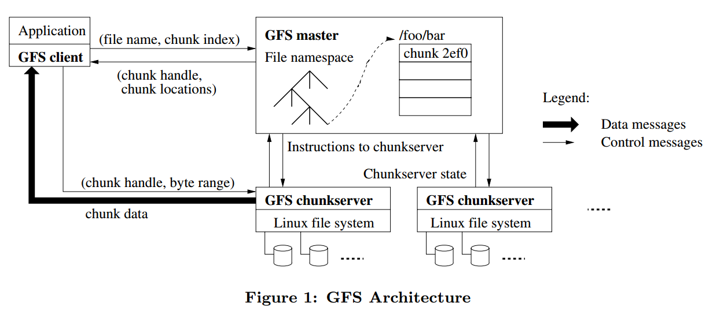
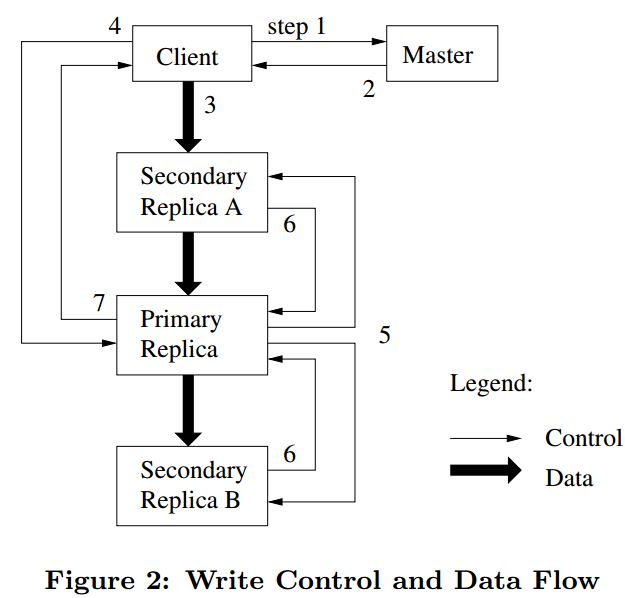
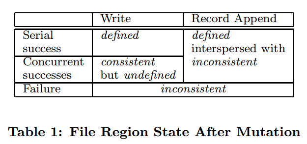

# 1. Introduction

本文是读GFS论文的总结，收录在我的github中[papers项目](https://github.com/Charles0429/papers)，papers项目旨在学习和总结分布式系统相关的论文。

全文主要分为以下几方面：

- Design Motivation
- Architecture
- System Interactions
- Master Operation
- Fault Tolerance and Diagnose
- Discussion

# 2. Design Motivation

google对现有系统的运行状态以及应用系统进行总结，抽象出对文件系统的需求，主要分为以下几个方面。

- 普通商用的机器硬件发生故障是常态
- 存储的问题普遍比较大，几个G的文件很常见
- 大部分的文件操作都是在追加数据，覆盖原来写入的数据的情况比较少见，随机写几乎不存在
- 读操作主要包括两种，large streaming read和small random read
- 为了应用使用方便，多客户端并行地追加同一个文件需要非常高效
- 带宽的重要性大于时延，目标应用是高速读大块数据的应用，对响应时间没有过多的需求

# 3. Architecture

本部分讨论gfs的总体架构，以及在此架构上需要考虑的一些问题。

##3.1 Overview

GFS的整体架构如下图：

(图片来源：gfs论文)

GFS中有四类角色，分别是

- GFS chunkserver
- GFS master
- GFS client
- Application

###3.1.1 GFS chunkserver

在GFS chunkserver中，文件都是分成固定大小的chunk来存储的，每个chunk通过全局唯一的64位的chunk handle来标识，chunk handle在chunk创建的时候由GFS master分配。GFS chunkserver把文件存储在本地磁盘中，读或写的时候需要指定文件名和字节范围，然后定位到对应的chunk。为了保证数据的可靠性，一个chunk一般会在多台GFS chunkserver上存储，默认为3份，但用户也可以根据自己的需要修改这个值。

### 3.1.2 GFS master

GFS master管理所有的元数据信息，包括namespaces，访问控制信息，文件到chunk的映射信息，以及chunk的地址信息（即chunk存放在哪台GFS chunkserver上）。

### 3.1.3 GFS client

GFS client是GFS应用端使用的API接口，client和GFS master交互来获取元数据信息，但是所有和数据相关的信息都是直接和GFS chunkserver来交互的。

### 3.1.4 Application

Application为使用gfs的应用，应用通过GFS client与gfs后端(GFS master和GFS chunkserver)打交道。

## 3.2 Single Master

GFS架构中只有单个GFS master，这种架构的好处是设计和实现简单，例如，实现负载均衡时可以利用master上存储的全局的信息来做决策。但是，在这种架构下，要避免的一个问题是，应用读和写请求时，要弱化GFS master的参与度，防止它成为整个系统架构中的瓶颈。

从一个请求的流程来讨论上面的问题。首先，应用把文件名和偏移量信息传递给GFS client，GFS client转换成(文件名，chunk index)信息传递给GFS master，GFS master把(chunk handle, chunk位置信息)返回给客户端，客户端会把这个信息缓存起来，这样，下次再读这个chunk的时候，就不需要去GFS master拉取chunk位置信息了。

另一方面，GFS支持在一个请求中同时读取多个chunk的位置信息，这样更进一步的减少了GFS client和GFS master的交互次数，避免GFS master成为整个系统的瓶颈。

## 3.3 Chunk Size

对于GFS来说，chunk size的默认大小是64MB，比一般文件系统的要大。

**优点**

- 可以减少GFS client和GFS master的交互次数，chunk size比较大的时候，多次读可能是一块chunk的数据，这样，可以减少GFS client向GFS master请求chunk位置信息的请求次数。
- 对于同一个chunk，GFS client可以和GFS chunkserver之间保持持久连接，提升读的性能。
- chunk size越大，chunk的metadata的总大小就越小，使得chunk相关的metadata可以存储在GFS master的内存中。

**缺点**

- chunk size越大时，可能对部分文件来讲只有1个chunk，那么这个时候对该文件的读写就会落到一个GFS chunkserver上，成为热点。

对于热点问题，google给出的解决方案是应用层避免高频地同时读写同一个chunk。还提出了一个可能的解决方案是，GFS client找其他的GFS client来读数据。

64MB应该是google得出的一个比较好的权衡优缺点的经验值。

##3.4 Metadata 

GFS master存储三种metadata，包括文件和chunk namespace，文件到chunk的映射以及chunk的位置信息。这些metadata都是存储在GFS master的内存中的。对于前两种metadata，还会通过记操作日志的方式持久化存储，操作日志会同步到包括GFS master在内的多台机器上。GFS master不持久化存储chunk的位置信息，每次GFS master重启或者有新的GFS chunkserver加入时，GFS master会要求对应GFS chunkserver把chunk的位置信息汇报给它。

### 3.4.1 In-Memory Data Structures

使用内存存储metadata的好处是读取metadata速度快，方便GFS master做一些全局扫描metadata相关信息的操作，例如负载均衡等。

但是，以内存存储的的话，需要考虑的是GFS master的内存空间大小是不是整个系统能存储的chunk数量的瓶颈所在。在GFS实际使用过程中，这一般不会成为限制所在，因为GFS中一个64MBchunk的metadata大小不超过64B，并且，对于大部分chunk来讲都是使用的全部的空间的，只有文件的最后一个chunk会存储在部分空间没有使用，因此，GFS master的内存空间在实际上很少会成为限制系统容量的因素。即使真的是现有的存储文件的chunk数量超过了GFS master内存空间大小的限制，也可以通过加内存的方式，来获取内存存储设计带来的性能、可靠性等多种好处。

### 3.4.2 Chunk Locations

GFS master不持久化存储chunk位置信息的原因是，GFS chunkserver很容易出现宕机，重启等行为，这样GFS master在每次发生这些事件的时候，都要修改持久化存储里面的位置信息的数据。

### 3.4.3 Operation Log

**operation log的作用**

- 持久化存储metadata
- 它的存储顺序定义了并行的操作的最终的操作顺序

**怎么存**

operation log会存储在GFS master和多台远程机器上，只有当operation log在GFS master和多台远程机器都写入成功后，GFS master才会向GFS client返回成功。为了减少operation log在多台机器落盘对吞吐量的影响，可以将一批的operation log形成一个请求，然后写入到GFS master和其他远程机器上。

**check point**

当operation log达到一定大小时，GFS master会做checkpoint，相当于把内存的B-Tree格式的信息dump到磁盘中。当master需要重启时，可以读最近一次的checkpoint，然后replay它之后的operation log，加快恢复的时间。

做checkpoint的时候，GFS master会先切换到新的operation log，然后开新线程做checkpoint，所以，对新来的请求是基本是不会有影响的。

# 4. System Interactions

本部分讨论GFS的系统交互流程。

## 4.1 Leases and Mutation Order

GFS master对后续的数据流程是不做控制的，所以，需要一个机制来保证，所有副本是按照同样的操作顺序写入对应的数据的。GFS采用lease方式来解决这个问题，GFS对一个chunk会选择一个GFS chunkserver，发放lease，称作primary，由primary chunkserver来控制写入的顺序。

Lease的过期时间默认是60s，可以通过心跳信息来续时间，如果一个primary chunkserver是正常状态的话，这个时间一般是无限续下去的。当primary chunkserver和GFS master心跳断了后，GFS master也可以方便的把其他chunk副本所在的chunkserver设置成primary。

### 4.1.1 Write Control and Data Flow

(图片来源：gfs论文)

1. GFS client向GFS master请求拥有具有当前chunk的lease的chunkserver信息，以及chunk的其他副本所在的chunkserver的信息，如果当前chunk没有lease，GFS master会分配一个。
2. GFS master把primary chunkserver以及其他副本的chunkserver信息返回给client。client会缓存这些信息，只有当primary chunkserver连不上或者lease发生改变后，才需要再向GFS master获取对应的信息。
3. client把数据推送给所有包含此chunk的chunkserver，chunkserver收到后会先把数据放到内部的LRU buffer中，当数据被使用或者过期了，才删除掉。注意，这里没有将具体怎么来发送数据，会在下面的Data Flow讲。
4. 当所有包含chunk副本的chunkserver都收到了数据，client会给primary发送一个写请求，包含之前写的数据的信息，primary会分配对应的序号给此次的写请求，这样可以保证从多个客户端的并发写请求会得到唯一的操作顺序，保证多个副本的写入数据的顺序是一致的。
5. primary转发写请求给所有其他的副本所在的chunkserver(Secondary replica)，操作顺序由primary指定。
6. Secondary replica写成功后会返回给primary replica。
7. Primary replica返回给client。任何副本发生任何错误都会返回给client。

这里，写数据如果发生错误可能会产生不一致的情况，会在consistency model中讨论。

## 4.2 Data Flow

4.1中第三步的Data Flow采用的是pipe line方式，目标是为了充分利用每台机器的网络带宽。假设一台机器总共有三个副本S1-S3。整个的Data Flow为：

1. client选择离它最近的chunkserver S1，开始推送数据
2. 当chunkserver S1收到数据后，它会立马转发到离它最近的chunkserver S2
3. chunkserver S2收到数据后，会立马转发给离它最近的chunkserver S3

不断重复上述流程，直到所有的chunkserver都收到client的所有数据。

以上述方式来传送B字节数据到R个副本，并假设网络吞吐量为T，机器之间的时延为L，那么，整个数据的传输时间为B/T+RL。

## 4.3 Atomic Record Appends

Append操作流程和写差不多，主要区别在以下

- client把数据推送到所有副本的最后一个chunk，然后发送写请求到primary
- primary首先检查最后一个chunk的剩余空间是否可以满足当前写请求，如果可以，那么执行写流程，否则，它会把当前的chunk的剩余空间pad起来，然后告诉其他的副本也这么干，最后告诉client这个chunk满了，写入下个chunk。

这里需要讨论的是，如果append操作在部分副本失败的情况下，会发生什么？

例如，写操作要追加到S1-S3，但是，仅仅是S1,S2成功了，S3失败了，GFS client会重试操作，假如第二次成功了，那么S1,S2写了两次，S3写了一次，目前的理解是GFS会先把失败的记录进行padding对齐到primary的记录，然后再继续append。

## 4.4 Snapshot

Snapshot的整个流程如下：

1. client向GFS master发送Snapshot请求
2. GFS master收到请求后，会回收所有这次Snapshot涉及到的chunk的lease
3. 当所有回收的lease到期后，GFS master写入一条日志，记录这个信息。然后，GFS会在内存中复制一份snapshot涉及到的metadata

当snapshot操作完成后，client写snapshot中涉及到的chunk C的流程如下：

1. client向GFS master请求primary chunkserver和其他chunkserver
2. GFS master发现chunk C的引用计数超过1，即snapshot和本身。它会向所有有chunk C副本的chunkserver发送创建一个chunk C的拷贝请求，记作是chunk C'，这样，把最新数据写入到chunk C'即可。本质上是copy on write。

## 4.5 Consistency Model

(图片来源：gfs论文)

GFS中consistent、defined的定义如下：

- consistent：所有的客户端都能看到一样的数据，不管它们从哪个副本读取
- defined：当一个文件区域发生操作后，client可以看到刚刚操作的所有数据，那么说这次操作是defined。

下面分析表格中出现的几种情况。

1. Write(Serial Success)，单个写操作，并且返回成功，那么所有副本都写入了这次操作的数据，因此所有客户端都能看到这次写入的数据，所以，是defined。
2. Write(Concurrent Successes)，多个写操作，并且返回成功，由于多个客户端写请求发送给priamary后，由primary来决定写的操作顺序，但是，有可能多个写操作可能是有区域重叠的，这样，最终写完成的数据可能是多个写操作数据叠加在一起，所以这种情况是consistent和undefined。
3. Write(Failure)，写操作失败，则可能有的副本写入了数据，有的没有，所以是inconsistent。
4. Record Append(Serial Success and Concurrent Success)，由于Record Append可能包含重复数据，因此，是inconsistent，由于整个写入的数据都能看到，所以是defined。
5. Record Append(Failure)，可能部分副本append成功，部分副本append失败，所以，结果是inconsistent。

GFS用version来标记一个chunkserver挂掉的期间，是否有client进行了write或者append操作。每进行一次write或者append，version会增加。

需要考虑的点是client会缓存chunk的位置信息，有可能其中某些chunkserver已经挂掉又起来了，这个时候chunkserver的数据可能是老的数据，读到的数据是会不一致的。读流程中，好像没有看到要带version信息来读的。这个论文中没看到避免的措施，目前还没有结果。

###4.5.1 Implications for Applications

应用层需要采用的机制：用append而不是write，做checkpoint，writing self-validating和self-identifying records。具体地，如下：

1. 应用的使用流程是append一个文件，到最终写完后，重命名文件
2. 对文件做checkpoint，这样应用只需要关注上次checkpoint时的文件区域到最新文件区域的数据是否是consistent的，如果这期间发生不一致，可以重新做这些操作。
3. 对于并行做append的操作，可能会出现重复的数据，GFS client提供去重的功能。

# 5. Master Operation

GFS master的功能包括，namespace Management， Replica Placement，Chunk Creation，Re-replication and Rebalancing以及Garbage Collection。

## 5.1 Namespace Management and Locking

每个master操作都需要获得一系列的锁。如果一个操作涉及到/d1/d2/.../dn/leaf，那么需要获得/d1,/d1/d2,/d1/d2/.../dn的读锁，然后，根据操作类型，获得/d1/d2/.../dn/leaf的读锁或者写锁，其中leaf可能是文件或者路径。

一个例子，当/home/user被快照到/save/user的时候，/home/user/foo的创建是被禁止的。

对于快照，需要获得/home和/save的读锁，/home/user和/save/user的写锁。对于创建操作，会获得/home,/home/user的读锁，然后/home/user/foo的写锁。其中，/home/user的锁产生冲突，/home/user/foo创建会被禁止。

这种加锁机制的好处是对于同一个目录下，可以并行的操作文件，例如，同一个目录下并行的创建文件。

## 5.2 Replica Placement

GFS的Replica Placement的两个目标：最大化数据可靠性和可用性，最大化网络带宽的使用率。因此，把每个chunk的副本分散在不同的机架上，这样一方面，可以抵御机架级的故障，另一方面，可以把读写数据的带宽分配在机架级，重复利用多个机架的带宽。

## 5.3 Creation, Re-replication, Rebalancing

###5.3.1 Chunk Creation

GFS在创建chunk的时候，选择chunkserver时考虑的因素包括：

1. 磁盘空间使用率低于平均值的chunkserver
2. 限制每台chunkserver的最近的创建chunk的次数，因为创建chunk往往意味着后续需要写大量数据，所以，应该把写流量尽量均摊到每台chunkserver上
3. chunk的副本放在处于不同机架的chunkserver上

## 5.3.2 Chunk Re-replication

当一个chunk的副本数量少于预设定的数量时，需要做复制的操作，例如，chunkserver宕机，副本数据出错，磁盘损坏，或者设定的副本数量增加。

chunk的复制的优先级是按照下面的因素来确定的：

1. 丢失两个副本的chunk比丢失一个副本的chunk的复制认为优先级高
2. 文件正在使用比文件已被删除的chunk的优先级高
3. 阻塞了client进程的chunk的优先级高(这个靠什么方法得到?)

chunk复制的时候，选择新chunkserver要考虑的点：

1. 磁盘使用率
2. 单个chunkserver的复制个数限制
3. 多个副本需要在多个机架
4. 集群的复制个数限制
5. 限制每个chunkserver的复制网络带宽，通过限制读流量的速率来限制

### 5.3.3 Rebalancing

周期性地检查副本分布情况，然后调整到更好的磁盘使用情况和负载均衡。GFS master对于新加入的chunkserver，逐渐地迁移副本到上面，防止新chunkserver带宽打满。

## 5.4 Garbage Collection

在GFS删除一个文件后，并不会马上就对文件物理删除，而是在后面的定期清理的过程中才真正的删除。

具体地，对于一个删除操作，GFS仅仅是写一条日志记录，然后把文件命名成一个对外部不可见的名称，这个名称会包含删除的时间戳。GFS master会定期的扫描，当这些文件存在超过3天后，这些文件会从namespace中删掉，并且内存的中metadata会被删除。

在对chunk namespace的定期扫描时，会扫描到这些文件已经被删除的chunk，然后会把metadata从磁盘中删除。

在与chunkserver的heartbeat的交互过程中，GFS master会把不在metadata中的chunk告诉chunkserver，然后chunkserver就可以删除这些chunk了。

采用这种方式删除的好处：

1. 利用心跳方式交互，在一次删除失败后，还可以通过下次心跳继续重试操作
2. 删除操作和其他的全局扫描metadata的操作可以放到一起做

坏处：

1. 有可能有的应用需要频繁的创建和删除文件，这种延期删除方式会导致磁盘使用率偏高，GFS提供的解决方案是，对一个文件调用删除操作两次，GFS会马上做物理删除操作，释放空间。

##5.5 Stale Replication Detection

当一台chunkserver挂掉的时候，有新的写入操作到chunk副本，会导致chunkserve的数据不是最新的。

当master分配lease到一个chunk时，它会更新chunk version number，然后其他的副本都会更新该值。这个操作是在返回给客户端之前完成的，如果有一个chunkserver当前是宕机的，那么它的version number就不会增加。当chunkserver重启后，会汇报它的chunk以及version number，对于version number落后的chunk，master就认为这个chunk的数据是落后的。

GFS master会把落后的chunk当垃圾来清理掉，并且不会把落后的chunkserver的位置信息传给client。

备注：

１. GFS master把落后的chunk当作垃圾清理，那么，是否是走re-replication的逻辑来生成新的副本呢？没有，是走立即复制的逻辑。

#6. Fault Tolerance and Diagnose

## 6.1 High Availability 

为了实现高可用性，GFS在通过两方面来解决，一是fast recovery，二是replication

###6.1.1 Fast Recovery 

master和chunkserver都被设计成都能在秒级别重启

### 6.1.2 Chunk Replications

每个chunk在多个机架上有副本，副本数量由用户来指定。当chunkserver不可用时，GFS master会自动的复制副本，保证副本数量和用户指定的一致。

###6.1.3 Master Replication 

master的operation log和checkpoint都会复制到多台机器上，要保证这些机器的写都成功了，才认为是成功。只有一台master在来做garbage collection等后台操作。当master挂掉后，它能在很多时间内重启；当master所在的机器挂掉后，监控会在其他具有operation log的机器上重启启动master。

新启动的master只提供读服务，因为可能在挂掉的一瞬间，有些日志记录到primary master上，而没有记录到secondary master上（这里GFS没有具体说同步的流程）。

## 6.2 Data Integrity

每个chunkserver都会通过checksum来验证数据是否损坏的。

每个chunk被分成多个64KB的block，每个block有32位的checksum，checksum在内存中和磁盘的log中都有记录。

对于读请求，chunkserver会检查读操作所涉及block的所有checksum值是否正确，如果有一个block的checksum不对，那么会报错给client和master。client这时会从其他副本读数据，而master会clone一个新副本，当新副本clone好后，master会删除掉这个checksum出错的副本。

## 6.3 Diagnose Tools

主要是通过log，包括重要事件的log(chunkserver上下线)，RPC请求，RPC响应等。

# 7. Discussion

本部分主要讨论大规模分布式系统一书上，列出的关于gfs的一些问题，具体如下。

## 7.1 为什么存储三个副本？而不是两个或者四个？

-  如果存储的是两个副本，挂掉一个副本后，系统的可用性会比较低，例如，如果另一个没有挂掉的副本出现网络问题等，整个系统就不可用了
- 如果存储的是四个副本，成本比较高

## 7.2 chunk的大小为何选择64MB？这个选择主要基于哪些考虑？

**优点**

- 可以减少GFS client和GFS master的交互次数，chunk size比较大的时候，多次读可能是一块chunk的数据，这样，可以减少GFS client向GFS master请求chunk位置信息的请求次数。
- 对于同一个chunk，GFS client可以和GFS chunkserver之间保持持久连接，提升读的性能。
- chunk size越大，chunk的metadata的总大小就越小，使得chunk相关的metadata可以存储在GFS master的内存中。

**缺点**

- chunk size越大时，可能对部分文件来讲只有1个chunk，那么这个时候对该文件的读写就会落到一个GFS chunkserver上，成为热点。

64MB应该是google得出的一个比较好的权衡优缺点的经验值。

## 7.3 gfs主要支持追加，改写操作比较少，为什么这么设计？如何设计一个仅支持追加操作的文件系统来构建分布式表格系统bigtable？

- 因为追加多，改写少是google根据现有应用需求而确定的
- bigtable的问题等读到bigtable论文再讨论

## 7.4 为什么要将数据流和控制流分开？如果不分开，如何实现追加流程？

主要是为了更有效地利用网络带宽。把数据流分开，可以更好地优化数据流的网络带宽使用。

如果不分开，需要讨论下。

## 7.5 gfs有时会出现重复记录或者padding记录，为什么？

**padding出现场景：**

- last chunk的剩余空间不满足当前写入量大小，需要把last chunk做padding，然后告诉客户端写入下一个chunk
- append操作失败的时候，需要把之前写入失败的副本padding对齐到master

**重复记录出现场景：**

- append操作部分副本成功，部分失败，然后告诉客户端重试，客户端会在成功的副本上再次append，这样就会有重复记录出现

## 7.6 lease是什么？在gfs中起到了什么作用？它与心跳有何区别？

lease是gfs master把控制写入顺序的权限下放给chunkserver的机制，以减少gfs master在读写流程中的参与度，防止其成为系统瓶颈。心跳是gfs master检测chunkserver是否可用的标志。

## 7.7 gfs追加过程中如果出现备副本故障，如何处理？如果出现主副本故障，应该如何处理？

- 对于备副本故障，写入的时候会失败，然后primary会返回错误给client。按照一般的系统设计，client会重试一定次数，发现还是失败，这时候client会把情况告诉给gfs master，gfs master可以检测chunkserver的情况，然后把最新的chunkserver信息同步给client，client端再继续重试。

- 对于主副本故障，写入的时候会失败，client端应该是超时了。client端会继续重试一定次数，发现还是一直超时，那么把情况告诉给gfs master，gfs master发现primary挂掉，会重新grant lease到其他chunkserver，并把情况返回给client。

## 7.8 gfs master需要存储哪些信息？master的数据结构如何设计？

namespace、文件到chunk的映射以及chunk的位置信息

namespace采用的是B-Tree，对于名称采用前缀压缩的方法，节省空间；（文件名，chunk index）到chunk的映射，可以通过hashmap；chunk到chunk的位置信息，可以用multi_hashmap，因为是一对多的映射。

## 7.9 假设服务一千万个文件，每个文件1GB，master中存储元数据大概占多少内存？

1GB/64MB = 1024 / 64 = 16。总共需要16 * 10000000 * 64 B = 10GB

## 7.10 master如何实现高可用性？

- metadata中namespace，以及文件到chunk信息持久化，并存储到多台机器
- 对metadata的做checkpoint，保证重启后replay消耗时间比较短，checkpoint可以直接映射到内存使用，不用解析
- 在primary master发生故障的时候，并且无法重启时，会有外部监控将secondary master，并提供读服务。secondary master也会监控chunkserver的状态，然后把primary master的日志replay到内存中

## 7.11 负载的影响因素有哪些？如何计算一台机器的负载值？

主要是考虑CPU、内存、网络和I/O，但如何综合这些参数并计算还是得看具体的场景，每部分的权重随场景的不同而不同。

## 7.12 master新建chunk时如何选择chunkserver？如果新机器上线，负载值特别低，如何避免其他chunkserver同时往这台机器上迁移chunk？

**如何选择chunkserver**

- 磁盘空间使用率低于平均值的chunkserver
- 限制每台chunkserver最近创建chunk的次数，因为创建chunk往往意味着后续需要写入大量数据，所以，应该把写流量均摊到每台chunkserver
- chunk的副本放置于不同机架的chunkserver上

**如何避免同时迁移**

通过限制单个chunkserver的clone操作的个数，以及clone使用的带宽来限制，即从源chunkserver度数据的频率做控制。

## 7.13 如果chunkserver下线后过一会重新上线，gfs如何处理？

因为是过一会，所以假设chunk re-replication还没有执行，那么在这期间，可能这台chunkserver上有些chunk的数据已经处于落后状态了，client读数据的时候或者chunkserver定期扫描的时候会把这些状态告诉给master，master告诉上线后的chunkserver从其他机器复制该chunk，然后master会把这个chunk当作是垃圾清理掉。

对于没有落后的chunk副本，可以直接用于使用。

## 7.14 如何实现分布式文件系统的快照操作？

Snapshot的整个流程如下：

1. client向GFS master发送Snapshot请求
2. GFS master收到请求后，会回收所有这次Snapshot涉及到的chunk的lease
3. 当所有回收的lease到期后，GFS master写入一条日志，记录这个信息。然后，GFS会在内存中复制一份snapshot涉及到的metadata

当snapshot操作完成后，client写snapshot中涉及到的chunk C的流程如下：

1. client向GFS master请求primary chunkserver和其他chunkserver
2. GFS master发现chunk C的引用计数超过1，即snapshot和本身。它会向所有有chunk C副本的chunkserver发送创建一个chunk C的拷贝请求，记作是chunk C'，这样，把最新数据写入到chunk C'即可。本质上是copy on write。

## 7.15 chunkserver数据结构如何设计？

chunkserver主要是存储64KB block的checksum信息，需要由chunk+offset，能够快速定位到checksum，可以用hashmap。

## 7.16 磁盘可能出现位翻转错误，chunkserver如何应对？

利用checksum机制，分读和写两种情况来讨论：

1. 对于读，要检查所读的所有block的checksum值
2. 对于写，分为append和write。对于append，不检查checksum，延迟到读的时候检查，因为append的时候，对于最后一个不完整的block计算checksum时候采用的是增量的计算，即使前面存在错误，也能在后来的读发现。对于overwrite，因为不能采用增量计算，要覆盖checksum，所以，必须要先检查只写入部分数据的checksum是否不一致，否则，数据错误会被隐藏。

## 7.17 chunkserver重启后可能有一些过期的chunk，master如何能够发现？

chunkserver重启后，会汇报chunk及其version number，master根据version number来判断是否过期。如果过期了，那么会做以下操作：

1. 过期的chunk不参与数据读写流程
2. master会告诉chunkserver从其他的最新副本里拷贝一份数据
3. master将过期的chunk加入garbage collection中

问题：如果chunkserver拷贝数据的过程过程中，之前拷贝的数据备份又发生了变化，然后分为两种情况讨论：

1. 如果期间lease没变，那么chunkserver不知道自己拷贝的数据是老的，应该会存在不一致的问题？
2. 如果期间lease改变，那么chunkserver因为还不能提供读服务，那么version number应该不会递增，继续保持stable状态，然后再发起拷贝。
