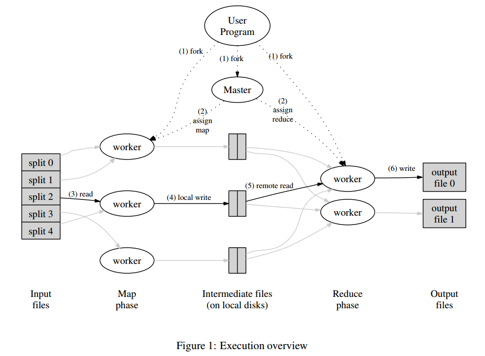

# 1. Introduction

本文是读MapReduce论文的总结。

Google发现有一些应用的计算模型比较简单，但涉及到大量数据，需要成百上千的机器来处理。如何并行化计算、分布数据和处理故障需要复杂的处理，MapReduce的出现即为了解决这个问题。通过提供的编程库，用户能轻松的写出处理逻辑，而内部的并行化计算、数据分布等问题由MapReduce来处理，大大简化了用户的编程逻辑。

MapReduce受到lisp等函数式编程语言的启发，发现大部分的计算任务包括两个处理流程：

- map操作：对每条逻辑记录计算Key/Value对
- reduce操作：对Key/Value按照相同k系统ey进行聚合

接下来，按照如下结构分析MapReduce系统

- Programming Model
- Implementation
- Refinements

# 2 Programming Model

MapReduce的计算以一组Key/Value对为输入，然后输出一组Key/Value对，用户通过编写Map和Reduce函数来控制处理逻辑。

Map函数把输入转换成一组中间的Key/Value对，MapReduce library会把所有相同的Key的中间结果聚合，然后传递给Reduce函数处理。

Reduce函数接收Key和其对应的一组Value，它的作用就是聚合这些Value，产生最终的结果。Reduce的输入是以迭代器的方式输入，使得MapReduce可以处理数据量比内存大的情况。

## 2.1 Example

以经典的word count为例，其伪代码为

```
map(String key, String value):
// key: document name
// value: document contents
for each word w in value:
	EmitIntermediate(w, "1");

reduce(String key, Iterator values):
// key: a word
// values: a list of counts
int result = 0;
for each v in values:
	result += ParseInt(v);
Emit(AsString(result));
```

Map函数吐出(word, count)的K/V对，Reduce把某个单词的所有的count加起来，最终每个单词吐出一个值。

除了Map和Reduce函数之外，用户还需要指定输入和输出文件名，以及一些可选的调节的参数。

## 2.2 Types

Map和Reduce函数的操作可以抽象的表示为

```
map    (k1,v2)          ======>list(k2,v2)
reduce (k2, list(v2))   ======>list(v2)
```

如上所示，map函数生成一系列的K/V中间结果，然后reduce对每个key，聚合其value。

## 2.3 More Examples

**Distributed Grep**

- 对于map，如果输入的行匹配到相应的pattern，则吐出这行
- 对于reduce，仅仅是把map吐出的行拷贝到输出中

**Count of URL Access Frequency**

- 对于map，处理web日志，生成(URL, 1)中间结果
- 对于reduce，聚合相同URL的值，生成(URL, total count)结果

**Reverse Web-Link Graph**

- 对于map，吐出(target, source)中间结果，其中target是被source引用的URL
- 对于reduce，聚合相同target的source，吐出(target, list(source))

**Term-Vector per Host**

Term Vector指的是一篇文档中的(word, frequency)K/V对。

- 对于map，吐出(hostname, term vector)中间结果
- 对于reduce，聚合相同hostname的term vector，吐出最终(hostname, term vector)

**Inverted Index**

- 对于map，吐出一系列的(word, document ID)
- 对于reduce，对相同word，按照document ID排序进行聚合，吐出(word, list(document ID))

**Distributed Sort**

- 对于map，吐出(key, record)中间结果
- 对于reduce，把map的中间结果写入到结果文件中，这里不需要显式地排序，因为MapReduce会自动地排序，方便在reduce的时候进行聚合。

# 3. Implementation

根据不同的环境，MapReduce的实现可以多种多样，例如，基于共享内存的，基于NUMA多核环境的以及基于多台机器组成的集群环境的。

Google的环境如下

- 双核X86系统，运行linux系统，2-4GB内存。
- 100M或1000M带宽网卡
- 集群由大量机器组成，故障是常态
- 每台机器使用廉价的IDE磁盘，采用GFS作为底层存储
- 使用一个调度系统来处理用户的任务

## 3.1 Execution Overview

Map会自动地把输入数据划分成M份，这些数据划分可以并行地被不同机器处理。Reduce按照划分函数划分数据，例如hash(key) mod R，其中R是由用户指定的。下图描述了MapReduce的整个流程，如下



1. MapReduce library会把输入文件划分成多个16到64MB大小的分片（大小可以通过参数调节），然后在一组机器上启动程序。
2. 其中比较特殊的程序是master，剩下的由master分配任务的程序叫worker。总共有M个map任务和R个reduce任务需要分配，master会选取空闲的worker，然后分配一个map任务或者reduce任务。
3. 处理map任务的worker会从输入分片读入数据，解析出输入数据的K/V对，然后传递给Map函数，生成的K/V中间结果会缓存在内存中。
4. map任务的中间结果会被周期性地写入到磁盘中，以partition函数来分成R个部分。R个部分的磁盘地址会推送到master，然后由它转发给响应的reduce worker。
5. 当reduce worker接收到master发送的地址信息时，它会通过RPC来向map worker读取对应的数据。当reduce worker读取到了所有的数据，它先按照key来排序，方便聚合操作。
6. reduce worker遍历排序好的中间结果，对于相同的key，把其所有数据传入到Reduce函数进行处理，生成最终的结果会被追加到结果文件中。
7. 当所有的map和reduce任务都完成时，master会唤醒用户程序，然后返回到用户程序空间执行用户代码。

成功执行后，输出结果在R个文件中，通常，用户不需要合并这R个文件，因为，可以把它们作为新的MapReduce处理逻辑的输入数据，或者其它分布式应用的输入数据。

## 3.2 Master Data Structure

master维护了以下信息

- 对每个map和reduce任务，记录了任务状态，包括idle,in-progress或completed，并且对于非idle状态的任务还记录了worker机器的信息
- 记录了map任务生成R个部分的文件位置信息

## 3.3 Fault Tolerance

分为两块，worker fault tolerance和master fault tolerance

**Worker Failure**

master采用ping的方式检测故障，如果一台worker机器在一定时间内没有响应，则认为这台机器故障。

- 对于map任务机器故障，完成了的map任务也需要完全重新执行，因为元算结果是存储在map任务所在机器的本地磁盘上的

当一个map任务开始由A来执行，而后挂掉后由B来执行，所有的为接收改任务数据的reduce任务的机器都会收到新的通知。

- 对于完成了的reduce任务则不需要重新执行，因为结果已经输出到GFS中

**Master Failure**

可以通过定期的checkpoint来保存状态，master挂掉后，可以回到最近checkpoint所在的状态。

但google没有采用这种方案，因为任务master挂掉概率极小，只需要让应用重试这次操作。

**Semantics in the Presence of Failure**

当用户提供的Map和Reduce函数的执行结果是确定的，那么最终的执行结果就是确定的。

当用户提供的执行结果不是确定的，那么最终结果也是不确定的，但是每个reduce任务产生的结果都是不确定的某次串行执行的结果。

## 3.4 Locality

由于输入数据是存储在GFS上的，所以，MapReduce为了减少网络通信，采取了以下优化策略

1. 因为GFS是按照64MB的chunk来存储数据的，这样可以把worker按照这个信息调度，尽量是每个worker都起到相应的GFS副本上，这样输入基本上是走本地磁盘
2. 如果上面的条件无法满足，那么尽量找一台和GFS副本机器在同一个交换机的机器

## 3.5 Task Granularity

MapReduce将map任务分成M份，reduce任务分成R份，理想状态M和R的值应该比worker机器大很多，这样有助于负载均衡以及故障恢复。因为当一台机器挂掉后，它的map任务可以分配给很多其他的机器执行。

实际应用中，因为master需要O(M+R)的空间来做调度决策，需要存储O(M*R)的任务产生的结果位置信息，对于每个任务产生的结果位置信息大约每个任务需要一个字节。

通常R的数量是由用户执行的，实际应用中对M的划分是要保证一个分片的数据量大小大约是16-64M，R的期望值是一个比较小的数。典型的M和R的值为 M = 200000，R = 5000，使用2000台worker机器。

## 3.6 Backup Tasks

通常，在执行过程中，会有少数几台机器的执行特别慢，可能是由于磁盘故障等原因引起的，这些机器会大大地增加任务的执行时间，MapReduce采用的方案是

- 当一个MapReduce操作快执行完成的时候，master会生成正在进行的任务的备份任务。只要其中一个任务执行完成，就认为该任务执行完成。

该机制在占有很少的计算资源的情况下，大大缩短了任务的执行时间。

# 4. Refinements

本节描述了一些提升效率的策略。

## 4.1 Partitioning Function

map任务的中间结果按照partitioning function分成了R个部分，通常，默认的函数`hash(key) mod R`可以提供相对均衡的划分。但有时应用需要按照自己的需求的来划分，比如，当Key是URL时，用户可能希望相同host的URL划分到一起，方便处理。这时候，用户可以自己提供partitioning function，例如`hash(Hostname(url))`。

## 4.2 Ordering Guarantees

对于reduce任务生成的结果，MapReduce保证其是按照Key排序的，方便reduce worker聚合结果，并且还有两个好处

- 按照key随机读性能较好
- 用户程序需要排序时会比较方便

## 4.3 Combiner Function

在有些情况下，map任务生成的中间结果中key的重复度很高，会造成对应的reduce任务通信量比较大。例如，word count程序中，可能和the相关的单词量特别大，组成了很多的(the, 1)K/V对，这些都会推送到某个reduce任务，会造成该reduce任务通信量和计算量高于其他的reduce任务。解决的方法是

- 在map任务将数据发送到网络前，通过提供一个`combiner`函数，先把数据做聚合，以减少数据在网络上的传输量


